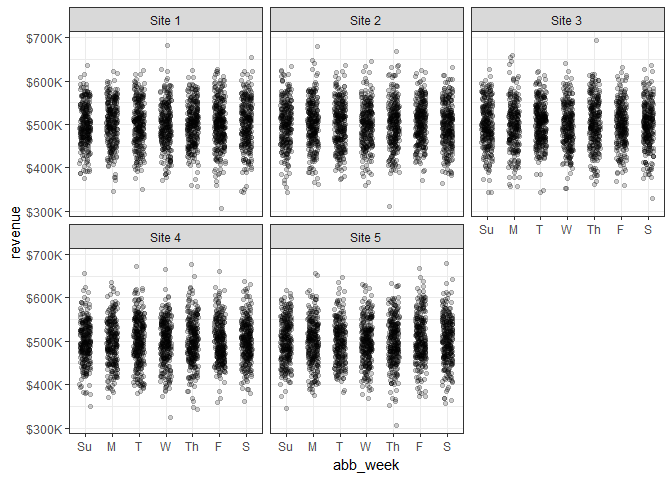

numform
============

    ## package 'wakefield' successfully unpacked and MD5 sums checked
    ## 
    ## The downloaded binary packages are in
    ##  C:\Users\Tyler\AppData\Local\Temp\Rtmp63YR34\downloaded_packages

    ## 
    ## wakefield installed

**numform** contains tools to assist in the formatting of numbers for
publication. Tools include the removal of leading zeros, standardization
of number of digits, and a p-value formatter.

Table of Contents
============

-   [[Installation](#installation)](#[installation](#installation))
-   [[Contact](#contact)](#[contact](#contact))
-   [[Available Functions](#available-functions)](#[available-functions](#available-functions))
-   [[Demonstration](#demonstration)](#[demonstration](#demonstration))
    -   [[Load Packages](#load-packages)](#[load-packages](#load-packages))
    -   [[Numbers](#numbers)](#[numbers](#numbers))
    -   [[Abbreviated Numbers](#abbreviated-numbers)](#[abbreviated-numbers](#abbreviated-numbers))
    -   [[Commas](#commas)](#[commas](#commas))
    -   [[Percents](#percents)](#[percents](#percents))
    -   [[Dollars](#dollars)](#[dollars](#dollars))
    -   [[Plotting](#plotting)](#[plotting](#plotting))
    -   [[Modeling](#modeling)](#[modeling](#modeling))

Installation
============

To download the development version of **numform**:

Download the [zip
ball](https://github.com/trinker/numform/zipball/master) or [tar
ball](https://github.com/trinker/numform/tarball/master), decompress and
run `R CMD INSTALL` on it, or use the **pacman** package to install the
development version:

    if (!require("pacman")) install.packages("pacman")
    pacman::p_load_current_gh("trinker/numform")
    pacman::p_load(tidyverse)

Contact
=======

You are welcome to: 
* submit suggestions and bug-reports at: <https://github.com/trinker/numform/issues> 
* send a pull request on: <https://github.com/trinker/numform> 
* compose a friendly e-mail to: <tyler.rinker@gmail.com>

Available Functions
===================

Below is a table of available **numform** functions. Note that `f_` is
read as "format" whereas `fv_` is read as "format vector". The former
formats individual values in the vector while the latter uses the vector
to compute a calculation on each of the values and then formats them.
Additionally, all **numform** non-methods functions have a functional
return version that is prefixed with an additional `f`. For example,
`f_num` has `ff_num` which has the same arguments but returns a function
instead. This is useful for passing in to **ggplot2** `scale_x/y_type`
functions (see [\[Plotting\](\#plotting)](#%5Bplotting%5D(#plotting))
for usage).

<!-- html table generated in R 3.3.3 by xtable 1.8-2 package -->
<!-- Thu Mar 09 08:44:18 2017 -->
<table>
<tr>
<td>
f_affix
</td>
<td>
f_mills
</td>
<td>
f_pad_zero
</td>
<td>
f_pval
</td>
<td>
fv_num_percent
</td>
</tr>
<tr>
<td>
f_bills
</td>
<td>
f_month
</td>
<td>
f_parenthesis
</td>
<td>
f_sign
</td>
<td>
fv_percent
</td>
</tr>
<tr>
<td>
f_comma
</td>
<td>
f_num
</td>
<td>
f_percent
</td>
<td>
f_suffix
</td>
<td>
fv_percent_diff
</td>
</tr>
<tr>
<td>
f_dollar
</td>
<td>
f_num_percent
</td>
<td>
f_prefix
</td>
<td>
f_thous
</td>
<td>
</td>
</tr>
<tr>
<td>
f_mean_sd
</td>
<td>
f_ordinal
</td>
<td>
f_prop2percent
</td>
<td>
f_weekday
</td>
<td>
</td>
</tr>
</table>

<b><em>Available Formatting Functions</em></b>

Demonstration
=============

Load Packages
-------------

    if (!require("pacman")) install.packages("pacman")
    pacman::p_load_gh("trinker/numform")
    pacman::p_load(dplyr)

Numbers
-------

    f_num(c(0.0, 0, .2, -00.02, 1.122222, pi, "A"))

    ## Warning in f_num(c(0, 0, 0.2, -0.02, 1.122222, pi, "A")): NAs introduced by
    ## coercion

    ## [1] ".0"  ".0"  ".2"  "-.0" "1.1" "3.1" NA

Abbreviated Numbers
-------------------

    f_thous(1234)

    ## [1] "1K"

    f_thous(12345)

    ## [1] "12K"

    f_thous(123456)

    ## [1] "123K"

    f_mills(1234567)

    ## [1] "1M"

    f_mills(12345678)

    ## [1] "12M"

    f_mills(123456789)

    ## [1] "123M"

    f_bills(1234567891)

    ## [1] "1B"

    f_bills(12345678912)

    ## [1] "12B"

    f_bills(123456789123)

    ## [1] "123B"

Commas
------

    f_comma(c(1234.12345, 1234567890, .000034034, 123000000000, -1234567))

    ## [1] "1,234.123"       "1,234,567,890"   ".000034034"      "123,000,000,000"
    ## [5] "-1,234,567"

Percents
--------

    f_percent(c(30, 33.45, .1), 1)

    ## [1] "30.0%" "33.5%" ".1%"

    f_percent(c(0.0, 0, .2, -00.02, 1.122222, pi))

    ## [1] ".0%"  ".0%"  ".2%"  "-.0%" "1.1%" "3.1%"

    f_prop2percent(c(.30, 1, 1.01, .33, .222, .01))

    ## [1] "30.0%"  "100.0%" "101.0%" "33.0%"  "22.2%"  "1.0%"

Dollars
-------

    f_dollar(c(0, 30, 33.45, .1))

    ## [1] "$0.00"  "$30.00" "$33.45" "$0.10"

    f_dollar(c(0.0, 0, .2, -00.02, 1122222, pi)) %>% 
        f_comma()

    ## [1] "$0.00"         "$0.00"         "$0.20"         "$-.02"        
    ## [5] "$1,122,222.00" "$3.14"

Plotting
--------

    library(tidyverse)

    data_frame(
        revenue = rnorm(10000, 500000, 50000),
        date = sample(seq(as.Date('1999/01/01'), as.Date('2000/01/01'), by="day"), 10000, TRUE),
        site = sample(paste("Site", 1:5), 10000, TRUE)
    ) %>%
        mutate(
            dollar = f_dollar(revenue, digits = -3),
            thous = f_thous(revenue),
            thous_dollars = f_thous(revenue, prefix = '$'),
            abb_month = f_month(date),
            abb_week = factor(f_weekday(date, distinct = TRUE), levels = c('Su', 'M', 'T', 'W', 'Th', 'F', 'S'))
        ) %T>%
        print() %>%
        ggplot(aes(abb_week, revenue)) +
            geom_jitter(width = .2, height = 0, alpha = .2) +
            scale_y_continuous(label = ff_thous(prefix = '$'))+
            facet_wrap(~site) +
            theme_bw()

    ## # A tibble: 10,000 × 8
    ##     revenue       date   site  dollar thous thous_dollars abb_month
    ##       <dbl>     <date>  <chr>   <chr> <chr>         <chr>     <chr>
    ## 1  602995.9 1999-05-27 Site 3 $603000  603K         $603K         M
    ## 2  523895.8 1999-05-03 Site 5 $524000  524K         $524K         M
    ## 3  544790.6 1999-11-28 Site 3 $545000  545K         $545K         N
    ## 4  454831.8 1999-01-19 Site 4 $455000  455K         $455K         J
    ## 5  414863.4 1999-02-18 Site 5 $415000  415K         $415K         F
    ## 6  489470.1 1999-06-06 Site 1 $489000  489K         $489K         J
    ## 7  546370.9 1999-10-14 Site 5 $546000  546K         $546K         O
    ## 8  478207.9 1999-09-10 Site 4 $478000  478K         $478K         S
    ## 9  526746.9 1999-09-11 Site 2 $527000  527K         $527K         S
    ## 10 575733.2 1999-03-29 Site 1 $576000  576K         $576K         M
    ## # ... with 9,990 more rows, and 1 more variables: abb_week <fctr>

Modeling
--------

We can see its use in actual model reporting as well:

    mod1 <- t.test(1:10, y = c(7:20))

    sprintf(
        "t = %s (%s)",
        f_num(mod1$statistic),
        f_pval(mod1$p.value)
    )

    ## [1] "t = -5.4 (p < .05)"

    mod2 <- t.test(1:10, y = c(7:20, 200))

    sprintf(
        "t = %s (%s)",
        f_num(mod2$statistic, 2),
        f_pval(mod2$p.value, digits = 2)
    )

    ## [1] "t = -1.63 (p = .12)"

We can build a function to report model statistics:

    report <- function(mod, stat = NULL, digits = c(0, 2, 2)) {
        
        stat <- if (is.null(stat)) stat <- names(mod[["statistic"]])
        sprintf(
            "%s(%s) = %s, %s", 
            gsub('X-squared', '&Chi;2', stat),
            paste(f_num(mod[["parameter"]], digits[1]), collapse = ", "),
            f_num(mod[["statistic"]], digits[2]),
            f_pval(mod[["p.value"]], digits = digits[3])
        )

    }

    report(mod1)

    ## [1] "t(22) = -5.43, p < .05"

    report(oneway.test(count ~ spray, InsectSprays))

    ## [1] "F(5, 30) = 36.07, p < .05"

    report(chisq.test(matrix(c(12, 5, 7, 7), ncol = 2)))

    ## [1] "&Chi;2(1) = .64, p = .42"

This enables in-text usage as well. First set up the models in a code
chunk:

    mymod <- oneway.test(count ~ spray, InsectSprays)
    mymod2 <- chisq.test(matrix(c(12, 5, 7, 7), ncol = 2))

And then use <code class="r">`` `r report(mymod)` ``</code> resulting in
a report that looks like this: F(5, 30) = 36.07, p &lt; .05. For
Χ2 using proper HTML leads to Χ2(1) = .64, p =
.42.